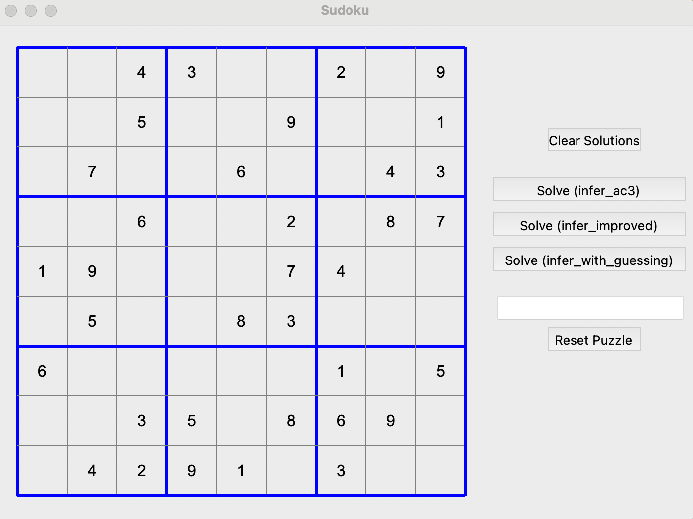
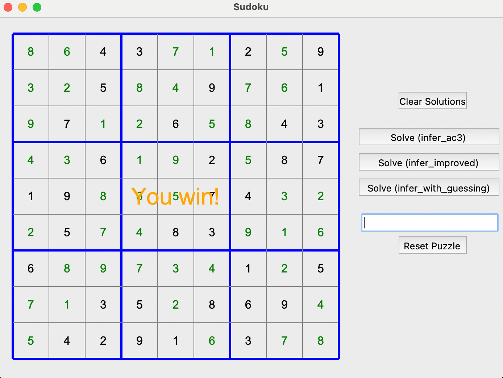

# Sudoku Solver 
An efficient implementation of a Sudoku solver that combines constraint satisfaction techniques with regular backtracking to solve puzzles with optimal performance.

## Features
AC-3 (Arc Consistency Algorithm #3), CSP (Constraint Satisfaction Problem), backtracking, logic inference

## Algorithm
1. AC-3 (Arc Consistency): Prunes impossible values by enforcing constraints between cells
2. Logical Inference: Identifies cells where only one number can be placed
3. Backtracking: When deterministic methods aren't enough, uses minimum remaining values heuristic

### Performance Advantages
Solves most easy/medium puzzles without backtracking
Significantly reduces search space for difficult puzzles
Optimizes memory usage through efficient domain representation
Models the problem using constraint graphs

## Visualization
The solver can be used through either:
Command-line interface: Basic visualization of the solution process in the terminal
GUI application: Interactive interface for visualizing the solving process

*Basic visualization of result can be shown in main function of suduku.py*
suduku_gui.py provides more clear visualization

*This is gui page before solving, you could choose methods of solving*

*This is ending page of solver, it will shows results and solution*